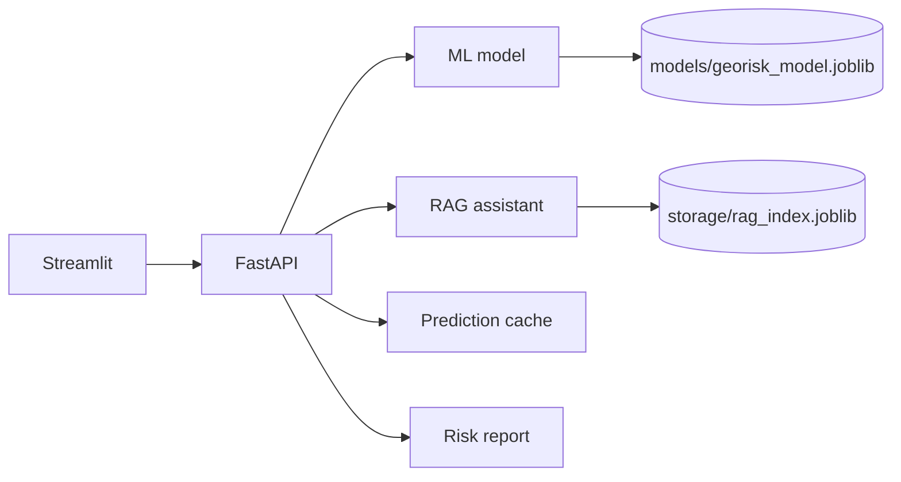

# GeoRisk AI Copilot

GeoRisk AI Copilot is an end-to-end AI Engineer portfolio project for environmental
and radiation risk analysis. It combines a traditional machine learning model for
radiation dose-rate prediction with a document-grounded RAG assistant for technical
PDF question answering.

The project is intentionally structured like an application, not a notebook:
FastAPI backend, Streamlit frontend, modular ML and RAG packages, Docker support,
tests, and documentation.

## Core Features

- Train a geospatial/tabular ML model to predict radiation dose rate from
  contamination, soil, terrain, hydrology, exposure, and location features.
- Train an optional advanced classic model from the original
  `Radiation_Dose_Rate_Prediction` MVP-B environmental and nuclide CSV files
  with spatial block cross-validation.
- Compare scenarios by changing input parameters and measuring predicted risk deltas.
- Explain predictions using SHAP when available, with a feature-importance fallback.
- Upload technical PDFs, retrieve relevant chunks, answer questions, and cite sources.
- Generate a concise risk analysis report combining ML results, scenarios,
  explainability, and document-grounded answers.
- Cache repeated predictions and expose request IDs/timing headers for API diagnostics.
- Expose the system through FastAPI and a simple Streamlit operator UI.
- Visualize the selected location in the Streamlit workflow and export results.
- Run locally or with Docker Compose.

## Project Structure

```text
app/          FastAPI backend, schemas, orchestration services
ml/           data generation, geospatial helpers, feature engineering, training, prediction
ml/classic/   advanced real-data model, spatial CV, artifact registry
rag/          PDF ingestion, retrieval store, LLM client, Q&A assistant
frontend/     Streamlit UI
tests/        unit tests for ML, RAG, and API health
docs/         architecture notes, API examples, screenshot folder
models/       generated model artifacts
data/processed/ real-data CSV drop zone
storage/      uploaded PDFs and retrieval index
```

## Architecture



The default retrieval index uses a local TF-IDF vector store so the demo runs
offline and inside tests. The RAG layer is isolated behind a small interface and
can be swapped for Chroma or FAISS. If `OPENAI_API_KEY` is set, the assistant uses
an LLM for grounded synthesis; otherwise it returns evidence-focused fallback
answers with citations.

API responses include `X-Request-ID` and `X-Process-Time-ms` headers. Repeated
ML predictions use an in-process LRU cache, which is cleared automatically after
model retraining.

## Quickstart

Recommended with `uv`:

```powershell
Copy-Item .env.example .env
# Edit .env and set GEORISK_API_KEY to a random local secret.
uv run --with-requirements requirements-dev.txt python -m ml.train
uv run --with-requirements requirements-dev.txt uvicorn app.main:app --reload
```

In another terminal:

```powershell
uv run --with-requirements requirements-dev.txt streamlit run frontend/streamlit_app.py
```

If you already have Python installed and prefer a classic virtual environment:

```powershell
py -m venv .venv
.\.venv\Scripts\Activate.ps1
pip install -r requirements-dev.txt
python -m ml.train
uvicorn app.main:app --reload
```

Open:

- API docs: http://localhost:8000/docs
- Frontend: http://localhost:8501

## Environment

Copy `.env.example` to `.env` and fill optional values:

```powershell
Copy-Item .env.example .env
```

Important variables:

- `GEORISK_API_URL`: frontend-to-backend URL.
- `GEORISK_DATA_MODE`: `synthetic` or `real`; current default endpoints remain
  synthetic, while advanced endpoints explicitly use real data.
- `GEORISK_API_KEY`: required API key for protected endpoints.
- `GEORISK_ALLOW_UNAUTHENTICATED`: local-only escape hatch. Keep `false` outside
  throwaway demos.
- `GEORISK_CORS_ALLOW_ORIGINS`: comma-separated browser origins allowed by CORS.
- `GEORISK_RATE_LIMIT_*`: in-memory rate limiting controls.
- `GEORISK_MODEL_PATH`: model artifact path.
- `GEORISK_ADVANCED_MODEL_PATH`: advanced model artifact path.
- `GEORISK_RAG_INDEX_PATH`: retrieval index path.
- `GEORISK_REAL_ENV_DATA_PATH`: path to `train_env_v1.csv`.
- `GEORISK_REAL_NUCLIDE_DATA_PATH`: path to `train_nuclide_v1.csv`.
- `GEORISK_REAL_TARGET_COLUMN`: real-data target column, defaults to
  `target_dose_rate`.
- `GEORISK_REAL_RECORD_ID_COLUMN`: merge key for env and nuclide CSVs, defaults
  to `Code`.
- `GEORISK_UPLOAD_DIR`: uploaded PDF storage path.
- `GEORISK_MAX_UPLOAD_MB`: max PDF upload size.
- `GEORISK_PDF_PROCESSING_TIMEOUT_SECONDS`: PDF ingestion timeout.
- `GEORISK_RAG_CHUNK_SIZE` and `GEORISK_RAG_CHUNK_OVERLAP`: retrieval chunking controls.
- `GEORISK_LLM_MAX_PROMPT_CHARS`: max prompt size sent to the LLM client.
- `OPENAI_API_KEY`: optional key for LLM-based answer synthesis.
- `GEORISK_LLM_MODEL`: optional LLM model name.

## Security

- CORS is restricted to local Streamlit origins by default. Do not use wildcard
  origins with credentials in production.
- Protected endpoints require `X-API-Key` by default. Set the same
  `GEORISK_API_KEY` in the API and frontend environments.
- Uploads use generated server-side filenames, size limits, and PDF processing
  timeouts.
- API requests are protected by an in-memory rate limiter. Use a shared limiter
  such as Redis when scaling to multiple API workers.
- LLM errors returned to users are intentionally generic so provider credentials
  are not reflected back through API responses.

## Model Training and Evaluation

Train the model:

```bash
python -m ml.train
```

This creates:

- `models/georisk_model.joblib`
- `models/georisk_model.metrics.json`
- `models/georisk_model.feature_importance.csv`

The synthetic dataset is generated from transparent environmental assumptions:
contamination is the dominant driver, while soil retention, runoff potential,
water proximity, exposure pressure, elevation, and spatial position modulate the
predicted dose rate.

For real GIS layers, `ml/geospatial.py` includes optional GeoPandas helpers for
converting latitude/longitude records into point geometries and enriching records
with nearest-layer distances.

## Advanced Real-Data Model

The original-project CSVs are tracked in:

```text
data/processed/train_env_v1.csv
data/processed/train_nuclide_v1.csv
```

The default advanced model mirrors MVP-B:

```text
model: extra_trees
feature_set: env_plus_no_ratio
target: target_dose_rate
spatial_cv_block_size_deg: 0.02
```

The advanced flow expects the nuclide table to contain:

```text
organic_carbon_b0, organic_carbon_b10, clay_fraction_0_30,
clay_fraction_30_60, sand_fraction_b0, sand_fraction_b10,
bulk_density_b0, bulk_density_b10, soil_pH_b0, soil_pH_b10,
elevation_m, slope_deg_final, twi_scaled, cs137_kBq_m2,
sr90_kBq_m2, k40_Bq_kg, ra226_Bq_kg, th232_Bq_kg
```

and a target column, defaulting to `target_dose_rate`. If the nuclide file
already contains the full MVP-B feature set, it is used directly to preserve the
original 545-row training table. Advanced training uses spatial block CV when
latitude/longitude are present.

Train advanced model:

```powershell
uv run --with-requirements requirements-dev.txt python -m ml.classic.train
```

Compare the integrated MVP-B model with the current project baselines:

```powershell
uv run --with-requirements requirements-dev.txt python -m ml.classic.compare_models
```

This writes `docs/model_comparison.md`.

## API Endpoints

- `GET /health`
- `POST /ml/train`
- `POST /ml/train/advanced`
- `POST /ml/predict`
- `POST /ml/predict/advanced`
- `POST /ml/scenarios`
- `POST /ml/scenarios/advanced`
- `POST /ml/explain`
- `POST /rag/upload`
- `POST /rag/ask`
- `POST /reports/risk`

Example payloads are in `docs/api_examples.md`.

## Docker

```bash
docker compose up --build
```

Services:

- FastAPI: http://localhost:8000
- Streamlit: http://localhost:8501

## Tests

```powershell
uv run --with-requirements requirements-dev.txt pytest
uv run --with-requirements requirements-dev.txt ruff check .
uv run --with-requirements requirements-dev.txt ruff format --check .
```

The tests cover model training/prediction/explanation, scenario sensitivity,
advanced real-data loading/training/prediction, retrieval with citations, API
health, request observability, and prediction caching. The same checks run in
GitHub Actions through `.github/workflows/ci.yml`.

## Troubleshooting

See `docs/troubleshooting.md` for common local setup issues, including Streamlit
imports, stale model artifacts, `uv` cache permissions, API connectivity, and
text extraction from scanned PDFs.

## Demo Flow

1. Start the API and frontend.
2. Train or refresh the model from the sidebar.
3. Run a baseline prediction.
4. Compare wet-year, remediation, or water-pathway scenarios.
5. Upload a technical PDF and ask a question.
6. Generate a report that combines the prediction, scenario deltas, drivers, and
   document-grounded context.

## Portfolio Notes

This project demonstrates the core responsibilities of an AI Engineer:

- building reusable ML pipelines,
- exposing model behavior through APIs,
- integrating explainability,
- grounding LLM answers in retrieved sources,
- designing a human-facing workflow,
- packaging with Docker,
- and adding tests that protect the main behavior.
