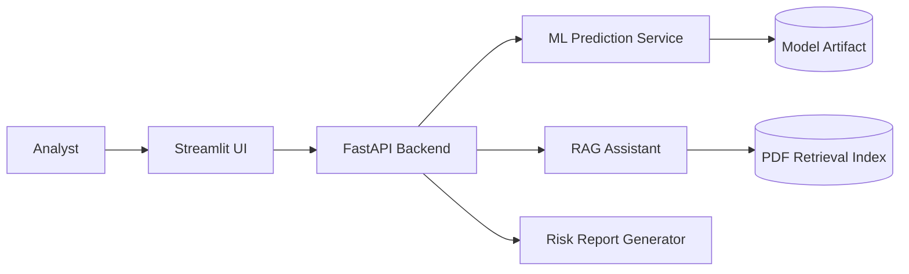

# GeoRisk AI Copilot Architecture

GeoRisk AI Copilot is organized as a production-style web/API application rather
than a notebook. The system has four layers:

1. **ML pipeline** in `ml/`
   - Generates a realistic synthetic radiation dataset for reproducible demos.
   - Engineers geospatial, soil, terrain, hydrology, and exposure features.
   - Trains a random forest regressor and persists metrics, feature importance,
     and a versioned model artifact.

2. **RAG pipeline** in `rag/`
   - Extracts text from uploaded technical PDFs.
   - Chunks pages with overlap and persists a local TF-IDF retrieval index.
   - Answers questions with citations and uses an LLM when `OPENAI_API_KEY` is set.

3. **FastAPI backend** in `app/`
   - Exposes training, prediction, scenario comparison, explainability, RAG upload,
     question answering, and report generation endpoints.

4. **Streamlit frontend** in `frontend/`
   - Provides a simple operator UI for predictions, scenarios, PDF Q&A, and reports.

## Data Flow

- A user submits contamination, soil, terrain, and location features.
- The backend loads or trains the model, engineers features, predicts dose rate,
  assigns a risk class, and returns an advisory.
- Scenario comparison applies parameter overrides to the baseline and computes
  deltas against the baseline prediction.
- Explainability returns SHAP values when available and falls back to signed
  feature-importance approximations.
- Uploaded PDFs are chunked into retrievable passages. RAG responses include
  source labels, page numbers, retrieval scores, and grounded text snippets.
