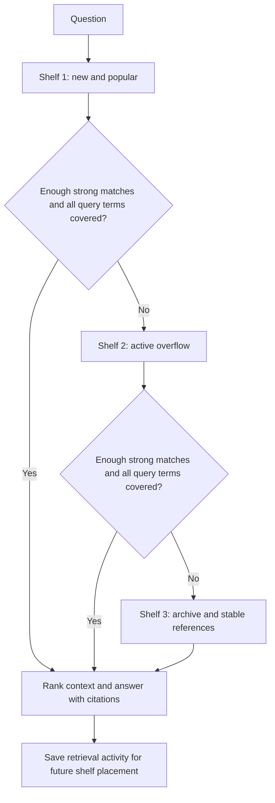

# RAG shelves

The local RAG index separates source passages from retrieval activity. Moving a
passage between shelves changes its search priority, preserving its text, ID,
source, page, and citation format.

| Shelf | Contents | Default capacity |
| --- | --- | --- |
| 1, top | Latest arrivals plus popular retrieved passages | 64 chunks |
| 2, middle | Next highest-priority active passages | 256 chunks |
| 3, bottom | Remaining passages and explicitly stable reference PDFs | All remaining chunks |

## Placement and popularity

Ordinary uploads enter the working shelves. The newest 16 non-stable chunks have
reserved places on shelf 1; its remaining places prefer decaying popularity,
then most recent use, then arrival order. If a batch exceeds the shelf capacity,
the latest chunks stay on top and overflow moves down without being discarded.
Reducing capacities takes effect at the next index load and never deletes text.
For small top shelves, reserved slots are clamped to leave at least one popularity
slot when capacity is greater than one. A one-place shelf with a reserved slot
holds the latest arrival; set recent slots to zero to favor popularity instead.

Each delivered passage with a cosine score of at least 0.35 gets one hit and one
unit of heat per search. Heat halves after 50 non-empty, in-vocabulary searches
without a new hit. Only the final selected passages receive credit; candidate
matches do not. This measures retrieval frequency, not user endorsement or
factual reliability. Old hits remain visible in metadata but their influence
decays. New evidence can displace previously popular material.

Select **Keep as stable reference material** in the PDF assistant, or send the
multipart field `stable=true` to `/rag/upload`, to keep newly indexed passages
on shelf 3. Stability is an explicit placement choice, not something inferred
from document age or certified by the LLM. Retrieval records hits for these
passages but never promotes them. Duplicate uploads remain deduplicated by
source, page, and stripped text; re-uploading does not reclassify existing chunks.

## Retrieval

TF-IDF uses a shared vocabulary and IDF across the corpus so scores from different
shelves are comparable. Search computes similarities only for rows on visited
shelves. It retains the best `top_k` candidates across those shelves, without
adding a popularity bonus to relevance scores. Ties use original chunk order.
Early stopping requires `top_k` matches each meeting the score threshold and
all analyzed query unigrams appearing in the selected context. Unknown query
terms prevent early stopping; wholly unknown or empty queries do no scoring.
If every shelf is visited, any positive matches are returned as before, even
when they fall below the early-stop threshold. Weak matches do not gain heat.

Early stopping is a retrieval heuristic: it can miss a better or conflicting
passage on a lower shelf. Select **Search all documents**, or pass
`"full_search": true` to `/rag/ask`, to score every shelf and get the global
TF-IDF ranking. This also includes stable references when the top shelf alone
would have satisfied the question. The report workflow uses the default staged
search. Shelf search does not change the existing TF-IDF tokenizer or add semantic
embeddings, translation, or a document correctness check.

Responses add `retrieved_context[].shelf` (the shelf at retrieval time) and a
`retrieval` object with `mode`, `shelves_searched`, `chunks_scored`, `total_chunks`,
`early_stopped`, and `shelf_counts`. Counts describe placement before the search;
successful retrieval can promote passages for the next query. Existing answer
and citation fields are retained.

## Persistence and scope

Version 2 of the joblib index stores chunks, fitted TF-IDF vectors, per-chunk
stability/hit/heat metadata, and a query counter. Existing chunk-only indexes fit
once and upgrade on their next successful transaction. New PDF text triggers a
refit; ordinary queries reuse fitted vectors. Current environment settings control
shelf placement on load, so tuning capacities does not require re-ingestion.

Both upload and question-answering use a per-index cross-process file lock around
load, update, and atomic file replacement. Failed writes preserve the previous
index. LLM calls run after the lock is released. Programmatic in-memory stores
stay in memory until explicitly saved; concurrent code sharing a disk index
should use `TfidfRAGStore.transaction(path)` too.

This remains a local index: requests deserialize the corpus, rebalance metadata,
and save the index after retrieval. Shelf search reduces similarity rows scored
and avoids refitting on every question, but it does not make total request cost
independent of corpus size. Large corpora would need separate persisted shelf
indexes and a smaller transactional activity store. No latency speedup is assumed
without measuring the intended workload.

## Configuration and verification

All controls are in `.env.example`: `GEORISK_RAG_TOP_CAPACITY`,
`GEORISK_RAG_MIDDLE_CAPACITY`, `GEORISK_RAG_RECENT_SLOTS`,
`GEORISK_RAG_HEAT_HALF_LIFE`, and `GEORISK_RAG_MIN_SCORE_PCT`.

`tests/test_rag_shelves.py` covers bounded search, overflow, promotion, decay,
stable references, fallback, full-search ranking, duplicate ingestion, index
migration, persistence across assistant instances, concurrent writers, and atomic
write failures. API tests cover the stable upload flag, full-search option,
retrieval trace, and preserved citations.
